# E-Commerce Customer Analytics Contoso 100k (SQL + Python) <!-- omit in toc -->


## Table of Contents <!-- omit in toc -->

- [1 - Executive Summary](#1---executive-summary)
- [2 - Key Findings:](#2---key-findings)
- [3 - Business Recommendations](#3---business-recommendations)
- [4 - Business Value Matrix](#4---business-value-matrix)
- [5 - Project Overview](#5---project-overview)
- [6 - Dataset Description](#6---dataset-description)
- [7 - Data Model](#7---data-model)
- [8 - Analysis Roadmap](#8---analysis-roadmap)
    - [8.1 - Customer Segmentation:](#81---customer-segmentation)
    - [8.2 - Cohort Analysis:](#82---cohort-analysis)
    - [8.3 - Retention Analysis:](#83---retention-analysis)
    - [8.4 - Customer Value Concentration:](#84---customer-value-concentration)
    - [8.5 - Delivery Performance:](#85---delivery-performance)
    - [8.6 - Seasonality Analysis:](#86---seasonality-analysis)
    - [8.7 - Statistical Validation](#87---statistical-validation)
- [9 - Analytical Workflow](#9---analytical-workflow)
    - [9.1 - Data Validation and Quality](#91---data-validation-and-quality)
    - [9.2 - Data Modeling](#92---data-modeling)
    - [9.3 - Customer Segmentation (RFM)](#93---customer-segmentation-rfm)
    - [9.4 - Cohort Analysis](#94---cohort-analysis)
    - [9.5 - Retention Analysis](#95---retention-analysis)
    - [9.6 - Customer Value Concentration](#96---customer-value-concentration)
    - [9.7 - Delivery Performance](#97---delivery-performance)
    - [9.8 - Seasonality Analysis](#98---seasonality-analysis)
    - [9.9 - Statistical Validation](#99---statistical-validation)
- [10 - Limitations](#10---limitations)
- [11 - Tools Used](#11---tools-used)
- [12 - Future Improvements](#12---future-improvements)
- [13 - Why this project matters](#13---why-this-project-matters)


## 1 - Executive Summary

This project analyzes a multi-year dataset of an e-commerce company (fictional) with the goal of understanding customer value, retention, lifecycle and retention risk, profitability drivers and operational performance.

Using **SQL** and **Python**, the analysis encompasses a complete customer analytics pipeline, that includes:

* Customer segmentation (RFM);
* Cohort and retention analysis;
* Customer value concentration (Pareto analysis);
* Delivery performance evaluation;
* Seasonality analysis;
* Statistical validation of key findings.

The objective is to identify where business value is concentrated, how customers behave over time and which operational factors influence performance.

## 2 - Key Findings:

**Customer value is highly concentrated**
  * Top 20% of customers generate approximately 60% of total profit.
  * High-value segments such as High-Value Stable and High-Value At Risk account for the majority of overall profitability.
  
This concentration highlights the importance of retention strategies focused on high-value customers.

**Retention challenges affect even valuable customers**
  * Many high-value customers fall into Inactive or Churned categories.
  * Several segments that previously generated significant revenue show declining recent activity.
  
Retention analysis reveals that a large number of historically valuable customers have become inactive. This suggests opportunities for targeted re-engagement campaigns.

**Delivery performance is operationally consistent**
  * Average delivery time across markets is approximately 1.3 days, with the majority of orders delivered the same day.
  * The 90th percentile delivery time is 4 days.
  * Country comparisons show only small differences between markets.

Although statistical tests detect differences across countries, the magnitude is minimal, indicating stable delivery performance across regions.

**Clear seasonal demand patterns exist**
  * February and December generate the highest average revenue.
  * Demand generally increases during late-year and early-year periods.
  * April is consistently the weakest month.

These patterns can inform inventory planning and marketing campaign timing.


## 3 - Business Recommendations

The following recommendations summarize the strategic actions derived from the analysis.

* **Prioritise win-back campaigns for high-value inactive customers**  
  
  86% of customers are churned, including 97% of Champions. A targeted re-engagement campaign focused on customers with recency between 90 and 365 days and high lifetime profit value could recover significant revenue at relatively low cost.

* **Protect the Champions segment proactively with loyalty programs**

  Only 44 Champions are currently active. Introducing a VIP loyalty program, early product access or exclusive offers before high-value customers disengage can prove to be more cost-effective than win-back campaigns after churn.


* **Focus on improving repeat-purchase conversion**

  55% of customers ordered only once. Improving second-purchase conversion through follow-up promotions or personalized offers could increase repeat purchases and could prove to have greater lifetime value impact than acquiring additional one-time buyers.

* **Align marketing campaigns with seasonal demand**  

  February and December consistently generate the highest revenue while April is the weakest month. Depending on strategic objectives, marketing investment could either concentrate on peak periods to capitalise on existing demand (conversion efficiency) while also exploring opportunities to stimulate demand during weaker periods (cost-effectiveness analysis needed).  

* **Maintain current delivery operations**  

  Delivery performance is consistent across all markets with 60%+ of orders delivered same-day. No operational intervention is derived as needed by the current data.


## 4 - Business Value Matrix

The following matrix links each analytical component of the project to the business questions it answers and the decisions it supports.

| Analysis                     | Business Question                                                           | Stakeholders                  | Business Value                                                                                             |
| ---------------------------- | --------------------------------------------------------------------------- | ----------------------------- | ---------------------------------------------------------------------------------------------------------- |
| Customer Segmentation (RFM)  | Which customers generate the most value and how should they be prioritized? | Marketing, CRM                | Enables targeted marketing campaigns and loyalty strategies focused on high-value customers.               |
| Cohort Analysis              | How does customer engagement evolve after acquisition?                      | Marketing, CRM               | Reveals retention patterns and helps evaluate the effectiveness of acquisition strategies.                 |
| Retention Analysis           | Which customers are becoming inactive or churned?                           | Marketing, CRM                | Identifies high-value customers at risk of churn and supports re-engagement campaigns.                     |
| Customer Value Concentration | How concentrated is profitability across customers?                         | Finance, Strategy             | Quantifies reliance on top customers and highlights the importance of retention among high-value segments. |
| Delivery Performance         | Does logistics performance vary across markets?                             | Operations, Supply Chain      | Evaluates delivery efficiency and identifies potential operational bottlenecks.                            |
| Seasonality Analysis         | When does demand peak or weaken during the year?                            | Marketing, Inventory Planning | Supports seasonal marketing campaigns and inventory planning.                                              |
| Statistical Validation       | Are observed differences statistically meaningful or driven by sample size?                          | Analytics, Leadership         | Separates genuine behavioral differences from noise, ensuring strategic decisions are based on actual evidence.                 |


## 5 - Project Overview
This project will use the Contoso (100k version) Dataset, which is a fictional sample dataset created by Microsoft. It represents a realistic but entirely made‑up company called Contoso.  

For this project I will follow this structured analytical workflow:

1. Data validation and preparation
2. Customer metrics
3. RFM segmentation
4. Cohort analysis
5. Retention Analysis
6. Customer value concentration
7. Delivery performance analysis
8. Seasonality analysis
9. Statistical validation

## 6 - Dataset Description

The Contoso dataset contains multi-year transactional records.

Key characteristics:
  * Orders - 83,000
  * Customers - 49,000
  * Products - 2,517
  * Countries - 8
  * Date range - January 2015 to April 2024

Each order may contain multiple order lines and includes product information, pricing, delivery dates and customer attributes.


## 7 - Data Model

* RAW TABLES
    * sales
    * customer
    * product
    * store
    * date (not used - date attributes derived directly from sales.orderdate)
    * currencyexchange (not used - exchange rates already in sales.exchangerate)
  
* Order level layer:
  * order_base (1 row per order)
  * order_enriched (order_base + customer and store context)
    * order revenue
    * order profit
    * delivery time
    * customer identifier
    * geographic information
  
    This will support the operational and temporal analysis.

* Customer Layer:
  * customer_summary (1 row per customer)
    * lifetime revenue
    * lifetime profit
    * order frequency
    * recency (days since last purchase)
    * first purchase date

    This will work as the foundation for segmentation and retention analysis.  

* Analytic Layer (per customer):
  * rfm_score
    * individual rfm score
    * total rfm score
  * customer_value_segments (financial classification)
    * profit tiers
  * customer_segments (behavioral and financial combined classification)
    * combined profit + behavioral segments
  * customer_retention_status
    * customer status (active to churned)


The analysis follows a layered data model built in PostgreSQL.  
Raw transactional data is first aggregated from order-line grain to order grain in **order_base**, then enriched with customer and store dimensions in **order_enriched**.  
A customer summary layer aggregates all orders to one row per customer, providing the lifetime metrics that will compute segmentation, RFM scoring, cohort analysis and retention classification. 

## 8 - Analysis Roadmap

The project answers several key business questions.

#### 8.1 - Customer Segmentation:

**Question**: Who are the most valuable customers?

**Metrics analyzed:**
  * lifetime revenue
  * lifetime profit
  * order frequency
  * average order value
  * customer distribution by segment

#### 8.2 - Cohort Analysis:

**Question**: How do different customer groups behave through time?

**Analyses included**:
  * cohort grouping by first purchase month
  * cohort revenue over time
  * retention patterns by cohort
  * cohort performance comparison

#### 8.3 - Retention Analysis:

**Question**: Which customers are becoming inactive or churned?

**Analyses included**:
  * inactivity classification
  * retention distribution
  * identification of high-value customers at risk

#### 8.4 - Customer Value Concentration:

**Question**: How concentrated is profitability across customers?

**Analysis included**:
  * profit distribution by customer percentile
  * Pareto analysis
  * Lorenz curve visualization

#### 8.5 - Delivery Performance:

**Question**: Is delivery performance consistent across markets?

**Analyses included**:
  * overall delivery statistics
  * delivery distribution
  * country comparisons

#### 8.6 - Seasonality Analysis:

**Question**: When does demand peak during the year?

**Analyses included**:
  * monthly revenue trends
  * average monthly seasonality
  * order distribution by day of week

#### 8.7 - Statistical Validation

**Question**: Are observer differences statistically meaningful?

**Tests performed**:
* ANOVA on average order value across segments.  
  
  Validate whether customer segmentation captures genuinely distinct purchasing behaviors.

* ANOVA on delivery time across countries.
  
  Test whether country-level delivery differences are meaningful or noise.


## 9 - Analytical Workflow

This section documents each analytical step in detail, e.g., what was built, what decisions were made and what the data revealed.

#### 9.1 - Data Validation and Quality

Initial validation to ensure that all tables are consistent and free from major data issues.

**What was done**:
* table sizes and relationships validation.
* customer-sales integrity verification.
* duplicate order line detection.
* missing values detection.
* unusual values detection (non-positive quantities, negative prices/costs).
* date ranges.
* delivery lag (min, max and impossible).
* netprice vs unitprice consistency.

**Findings**:
* sales table presents: row -> order+line (one order can have multiple lines), therefore aggregation is needed for order-level analysis.
* no orphaned foreign keys (sales.customerkey/customer.customerkey).
* no duplicate orderkey in sales table.
* no duplicate customerkey in customer table.
* no duplicate productkey in product table.
* no duplicate order+linenumber pairs in sales table.
* no null values in sales table.
* no unusual values.
* conversion needed to get USD (quantity × netprice / exchangerate).
* typical order has on average 3 lines (min 1 and max 7).
* 65% of orders are multiline.
* data from 2015-01-01 to 2024-04-20.
* delivery times range from 0 to 19 days (no negative values).
* netprice differs from unitprice (promotions).

[SQL Code](01_data_validation.sql)  
[Python Code](01_data_validation.ipynb) 

#### 9.2 - Data Modeling

Following the integrity validation stage, views were created to support customer-level and operational analysis by extracting or creating key data from the raw transactional tables.

The sales table presents data at an order-line level (one row per product within an order) making direct customer level analysis impossible without aggregation.

**What was done:**

* Analystical layers were created:
  * order_base - aggregates sales lines to one row per order, presenting revenue, cost and profit in USD as well as delivery time. 
   
    [SQL code - order views](02_base_views.sql)  
    [Python code - order views](02_base_views.ipynb)

  * order_enriched - joins order_base with customer and store tables, adding geographic, demographic and operational context to every order. This view serves as the primary input for all analyses that follow, mainly operational and time-based analysis.
  
    [SQL code - order views](02_base_views.sql)  
    [Python code - order views](02_base_views.ipynb)

  * customer_summary - aggregates order_enriched to one row per customer, presenting lifetime metrics, revenue, profit, recency, frequency, first and last purchase dates and cohort month. This view will support customer lifecycle and value analysis (segmentation, retention and value concentration analysis).

    [SQL code - customer view](03_customer_summary_rfm.sql)  
    [Python code - customer view](03_customer_summary.ipynb)

**Key design decisions:**
  * revenue calculated as quantity x netprice / exchangerate for USD currency.
  * netprice used instead of unitprice to reflect actual transaction value after promotions.
  * delivery time uses MAX(deliverydate) per order to capture the last arrived item, not the first.
  * order_base is intentionally separate from order_enriched to keep aggregation logic isolated from other joins.


#### 9.3 - Customer Segmentation (RFM)

Customer segmentation was performed using the RFM method, which classifies customers based on three dimensions of purchasing behavior (**R**ecency, **F**requency and **M**onetary value).

**What was done:**

* Three metrics were calculated for each customer:
  * Recency (engagement) - days since last purchase.
  * Frequency (loyalty) - total number of orders.
  * Monetary (value) - customer lifetime revenue.
  
  Customers were then assigned scores for each metric using PERCENT_RANK() instead of NTILE() to avoid splitting customers with identical values across different score buckets.

  ```sql
  (...)
  percent_rank() over (order by recency_days ASC) as recency_pct,
  --recency score is the inverse of the other metrics, as higher recency should get lower scores.
  percent_rank() over (order by order_count DESC) as frequency_pct,
  percent_rank() over (order by lifetime_revenue DESC) as monetary_pct

  (...)

  CASE
    when recency_pct < 0.20 then 5
    when recency_pct < 0.40 then 4
    when recency_pct < 0.60 then 3
    when recency_pct < 0.80 then 2
    else 1
  end as recency_score,
   
  CASE
    WHEN order_count = 1 THEN 1
    WHEN order_count = 2 THEN 2
    WHEN order_count = 3 THEN 3
    WHEN order_count = 4 THEN 4
    ELSE 5
  END AS frequency_score,

  CASE
    WHEN monetary_pct < 0.20 THEN 5
    WHEN monetary_pct < 0.40 THEN 4
    WHEN monetary_pct < 0.60 THEN 3
    WHEN monetary_pct < 0.80 THEN 2
    ELSE 1
  END AS monetary_score
  ```

  Frequency was scored using manual thresholds rather than percentiles, due to extreme right-skewness (55% of customers placed exactly one order and 28.1% placed two). Considering that a combined 84% of customers have an order count <=2. percentile boundaries would be meaningless.

  RFM scores were then combined with absolute lifetime profit tiers (High Value, Mid-High Value, Low-Mid Value, Low Value) to produce a final combined segmentation. This method captures both historical value and current engagement 
  simultaneously - a customer who spent heavily years ago but is no longer active is treated differently from one who is actively purchasing today.

  [SQL code - RFM](04_rfm_analysis.sql)  
  [Python code - RFM](04_rfm_analysis.ipynb)

  Here is a summary table for the segmentation used in this project:

| Value Tier (profit percentile)                           | Segment            | Classification Logic                                                                                  | Typical Behavior                                            |
|--------------------------------------|--------------------|--------------------------------------------------------------------------------------------------------|-------------------------------------------------------------|
| High Value (>75%)                    | Champions          | lifetime_profit ≥ p75 AND recency_score ≥ 4 AND frequency_score ≥ 4                                     | Most engaged and profitable customers                       |
| High Value (>75%)                    | High-Value At Risk | lifetime_profit ≥ p75 AND recency_score ≤ 2                                                             | Previously valuable customers whose engagement is declining |
| High Value (>75%)                    | High-Value Stable  | lifetime_profit ≥ p75 AND NOT (recency_score ≥ 4 AND frequency_score ≥ 4) AND recency_score > 2        | Valuable repeat customers with stable/moderate engagement   |
| Mid–High Value (50–75%)              | Loyal              | p50 ≤ lifetime_profit < p75 AND rfm_total_score ≥ 10                                                    | Consistent repeat customers                                 |
| Mid–High Value (50–75%)              | Potential Loyalist | p50 ≤ lifetime_profit < p75 AND rfm_total_score < 10                                                    | Customers likely to become loyal                            |
| Low–Mid Value (25–50%)               | Promising          | p25 ≤ lifetime_profit < p50 AND rfm_total_score ≥ 10                                                    | Engaged customers with growth potential                     |
| Low–Mid Value (25–50%)               | Needs Attention    | p25 ≤ lifetime_profit < p50 AND rfm_total_score < 10                                                    | Customers showing signs of disengagement                    |
| Low Value (<25%)                     | Budget Loyalist    | lifetime_profit < p25 AND rfm_total_score ≥ 10                                                          | Loyal but low-spend customers                               |
| Low Value (<25%)                     | Low Priority       | lifetime_profit < p25 AND rfm_total_score < 10                                                          | Customers with minimal economic contribution                |


[SQL code - Value Segmentation](05_customer_value_segmentation.sql)  
[Python code - Value Segmentation](05_customer_value_segmentation.ipynb)


[SQL code - Customer Segmentation](06_customer_segmentation.sql)  
[Python code - Customer Segmentation](06_customer_segmentation.ipynb)

**Why this approach:**  
  
RFM segmentation is widely used in retail and e-commerce analytics because it captures three critical dimensions of customer behavior: engagement (recency), loyalty (frequency) and value (monetary). Combining RFM with profit-based tiers adds an economic dimension to the behavioral scoring. This translates behavioral metrics into actionable customer groups that can guide marketing and retention strategies.

The segmentation emphasizes greater behavioral granularity within high-value customers (3 segments) because small engagement differences among these customers have the largest impact on total profitability. Therefore, there's a need to distinguish between valuable customers who are active, stable or at risk of churn.

**Visualizations:**

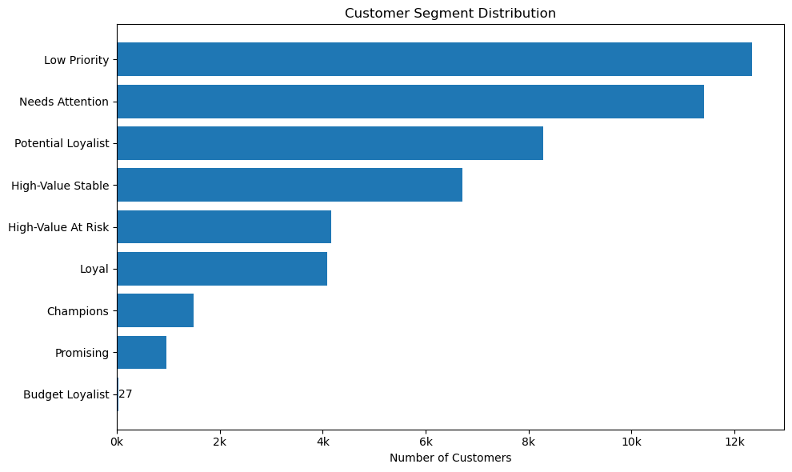

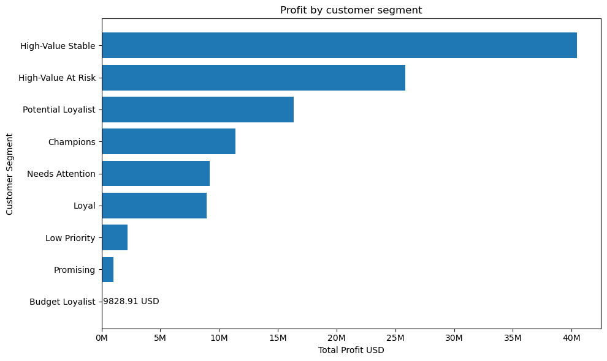

**Findings:**

Monthly activity rate:

* Customer segments reveal clear differences in engagement and economic value.
* High-value segments such as Champions, High-Value Stable and High-Value at Risk contribute a disproportionate share of total profit (67%), despite being fewer than 25% of total customers.
* Champions represent only 3% (1,493) of customers but generate the highest profit per customer (7,620 USD).
* 55% of customers placed exactly one order, making repeat purchase conversion the central retention challenge. Acquiring a customer who never returns has limited lifetime value regardless of their first order size.
* Only 5% of customers placed 4 or more orders.


**Recommended Actions:**  

* Prioritize retention of high-value customers, especially those showing declining recency.
* Design loyalty programs targeting Champions and Loyal customers.
* Develop re-engagement campaigns for High-Value At Risk customers.


#### 9.4 - Cohort Analysis

Cohort analysis was used to evaluate how customer engagement evolves after acquisition, separating customers by the month they first purchased to reveal lifecycle patterns over time.
Considering the importance of this section's visualizations, interpretation of those were provided beneath their respective plots.

**What was done:**

Customers were grouped into monthly cohorts based on their first purchase date. Monthly cohort were chosen instead of yearly cohorts to preserve sufficient granularity to observe retention decay patterns. 

Two retention metrics were calculated:

* *Monthly activity rate*:  
  Percentage of customers from a cohort who made at least one purchase in a given month since their first purchase. Values can rise and fall as a customer can skip a month but return later. This metric captures repeat purchase timing and cyclical behavior.


* *Rolling retention rate*:  
Percentage of customers who returned at least once after a given month. Values only decrease over time as customers who never return are permanently counted as lost. This metric reflects long-term customer persistence.


**Why this approach:** 

The two metrics are complementary.
<u> Monthly activity rate </u> shows when customers tend to return and captures repeat purchase timing and cyclical behavior, while <u>rolling retention</u> shows how many customers are permanently lost over time, in other words, the share of the cohort that ever returned after each month threshold, providing a view of long-term customer persistence. 
Using both avoids the misleading impression that rising activity in later months indicates improving retention. 


**Visualizations:**

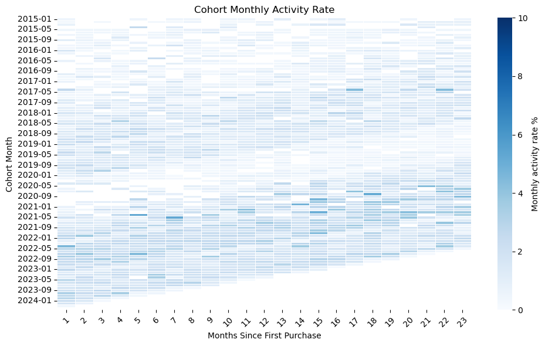

<u>Interpretation of cohort activity rate heatmap</u>: Most of the chart is very light, which suggests cohort activity rate is generally low relative to the 0–10% range shown on the colorbar (global scale). Rather than one simple overall pattern (clean left to right fade in every row), there are scattered darker pockets, making this very uneven, possibly reflecting specific strong cohorts, seasonal effects, campaign effects or product changes.

A vertical analysis (cohort quality), for example picking a particular column, we can see that lower rows are darker than upper rows, suggesting that newer cohorts are retaining better than older cohorts at the same stage of maturity.
Cohorts from roughly 2020 to 2022 appear to contain more medium-blue cells than many earlier cohorts, which may indicate stronger acquisition quality or different customer mix during that period. The newest cohorts near the bottom-left also show some relatively darker early-life cells, though they have fewer observable later months because they are newer. 

Diagonal patches (seasonality) are also visible, meaning that there were activity spikes or dips at the same absolute calendar time, regardless of cohort. 


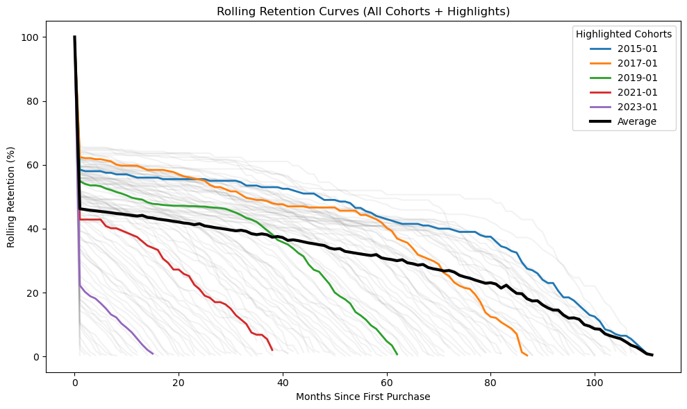
*Note about this line chart: background (faded) are all cohorts. A few particular ones (early, mid and recent cohorts) were highlighted for clarity. The average rolling retention of all cohorts is also presented to show overall pattern. Heatmap of this graph isn't as visually informative as this line chart, but it is still provided below*


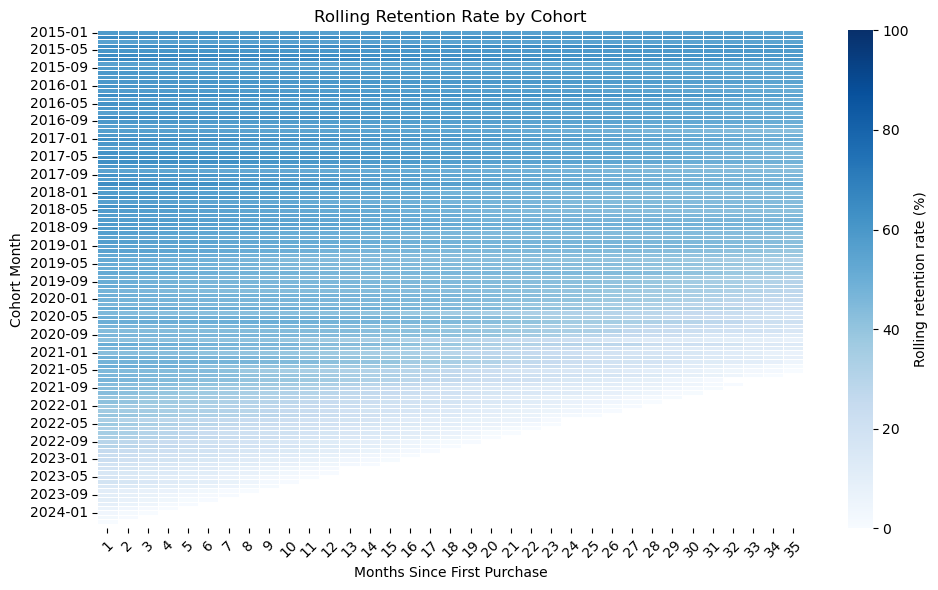

<u>Interpretation of cohort rolling retention rate heatmap</u>: Each cell means “share of the cohort that purchased in this month or any later month,” so the chart is showing the probability that a customer is still “alive” by each lifecycle threshold.

Rows fade left to right which is an expected retention decay. Every cohort loses customers over time.

Newer cohorts look lighter. Also normal considering that they haven't had enough time to accumulate long-term retained customers (cohort customers haven't had enough time to eventually return). But can also mean weaker customer quality, different acquisition channels, changes in product or pricing, or other CRM policies with low effectiveness.

Some cohorts seem to flatten out (somewhat constant retention rate for many months), which means that remaining customers are "sticky" and have long purchase cycles, therefore, the cohort seems more unlikely to churn further.

There are no diagonal patterns, because retention is cumulative and does not reflect seasonality.

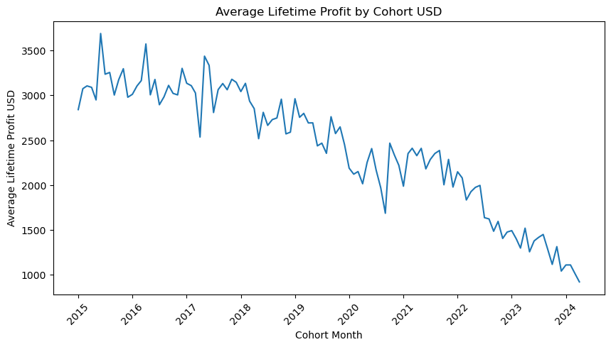

Interpretation: Average lifetime profit does not increase with cohort age. Cohort quality appears to vary meaningfully across acquisition periods, suggesting that differences in customer mix or purchasing behavior may matter as much as cohort age.

**Findings:**

<u>Activity rate</u>:
* Early month activity appears stronger for some newer cohorts, especially after 2020.
* Repeat purchasing is sparse outside the acquisition month, suggesting many customers do not repurchase immediately (sporadic purchasing behavior).
* Activity rate heatmap suggests possible seasonal or external effects influencing multiple cohorts.
* Customers seem to return after long gaps, either promotions or reactivation strategies or customer restocking needs.

<u>Rolling retention</u>:
* Retention declines significantly after the initial purchase period. Nearly all cohorts fall from 100% (month 0 retention is 100% by definition) to around 60% very quickly, consistent with the finding that 55% of customers ordered only once.
* Some early cohorts (2015-2017) show stronger long-term retention, possibly reflecting a smaller but more loyal initial customer base.
* Later cohorts show similar retention patterns to earlier cohorts. Lines overlap heavily, so this signals behavior stability over time.
* Cohort revenue contribution diminishes as cohort ages. 

<u>Lifetime profit</u>:
* Average lifetime profit steadily decreases for newer cohorts, which is expected, since new cohorts have had fewer months to accumulate purchases.
* Early cohorts 2015-2017 show strong variability with some peaks above 3,600 USD profit per customer, suggesting that customer acquisition quality differed across periods (marketing, pricing, product mixing?).
* Cohorts acquired after 2021 show significantly lower average lifetime profit. This is primarily due to shorter observation windows, though it could also indicate changes in acquisition strategy or customer behavior.


**Recommended actions:**

* Strengthen post-purchase engagement programs or communication.
* Encourage second purchases 30-60 days after acquisition, when the drop-off is more evident.
* Develop marketing campaigns targeting early-stage customers.
* Investigate why early (first) cohorts retained better than recent ones.


[SQL code - cohort analysis activity rate and average lifetime profit]()  
[Python code - cohort analysis activity rate and average lifetime profit]()  

[SQL code - cohort analysis rolling retention]()  
[Python code - cohort analysis rolling retention]() 

#### 9.5 - Retention Analysis

In this section, the goal is to identify customers at risk of churn, quantify the profit at stake and determine which segments carry the highest retention risk.

**What was done:**

Customers were classified based on their recency of purchase.

| Status   | Recency     |
|----------|-------------|
| Active   | ≤ 30 days   |
| Cooling  | 31–90 days  |
| Inactive | 91–180 days |
| Churned  | > 180 days  |

Retention status was then crossed with customer segments to identify which segments carry the highest churn risk and what profit is at stake in each combination.

The 25 highest-value inactive customers were also identified individually to support targeted re-engagement prioritization.

**Why this approach:**

Customer classification based on recency is a standard CRM technique that provides an immediately actionable view of customer 
health. Crossing retention status with segments adds economic context because not all churned customers represent equal risk to the business (churned Low Priority 
customer and a churned Champion require completely different responses).


**Visualizations:**

* Retention status summary:
  
| Retention Status | Customers | % Customers | Total Revenue | Total Profit |
|------------------|-----------|-------------|---------------|--------------|
| Churned          | 42,575    | **86.03**       | 173,594,804.22| 97,092,974.52|
| Inactive         | 3,714     | 7.51        | 17,058,171.74 | 9,557,910.70 |
| Cooling          | 2,791     | 5.64        | 13,631,023.73 | 7,616,569.40 |
| Active           | 407       | 0.82        | 1,989,146.76  | 1,112,149.40 |

* Profit by retention status:
  
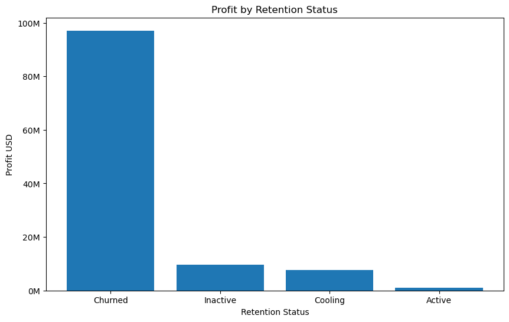


* Segment x Retention Status:

| Combined Segment        | Retention Status | Customers | Total Profit | Profit Share (%) |
|-------------------------|------------------|-----------|--------------|------------------|
| Champions               | Active           | 44        | 322,323.37   | 0.28             |
| Champions               | Cooling          | 267       | 1,969,401.04 | 1.71             |
| Champions               | Inactive         | 315       | 2,252,475.85 | 1.95             |
| Champions               | Churned          | 867       | 6,833,152.66 | 5.92             |
| High-Value Stable       | Active           | 84        | 476,034.10   | 0.41             |
| High-Value Stable       | Cooling          | 586       | 3,473,544.21 | 3.01             |
| High-Value Stable       | Inactive         | 734       | 4,262,990.96 | 3.69             |
| High-Value Stable       | Churned          | 5,316     | 32,251,355.01| 27.95            |
| High-Value At Risk      | Churned          | 4,159     | 25,848,272.47| 22.40            |
| Loyal                   | Active           | 95        | 200,532.01   | 0.17             |
| Loyal                   | Cooling          | 639       | 1,354,379.33 | 1.17             |
| Loyal                   | Inactive         | 939       | 2,012,971.15 | 1.74             |
| Loyal                   | Churned          | 2,409     | 5,364,605.90 | 4.65 

*Just the high value segments for easy viewing. Remaining segments follow a similar pattern with lower absolute profit impact.*

**Findings:**

* A large proportion of customers are currently inacive or churned:
  
  | % Customers | Status   |
  |------------------------|----------|
  | 86.03%                | Churned  |
  | 7.51%                 | Inactive |
  | 5.64%                 | Cooling  |
  | 0.82%                 | Active   |

* Only 44 (3%) of 1,493 Champions are currently active. The rest have Churned, gone Inactive or are Cooling. Consistent with the previous finding of very large number of one-time buyers.
* The High-Value At Risk segment is 100% Churned. All 4,159 customers of this segment have already disengaged, representing 25.8M USD in lifetime profit.
* High-Value Stable and High-Value At Risk segments together account for the majority of churned profit, making them the highest-priority re-engagement targets.
* Several individual high-value customers have not purchased in over 2,000 days. Recovery probability for these customers is considered low.


**Recommended Actions:**

* Launch targeted win-back campaigns for Churned and Inactive customers with moderate recency (maybe between 90 and 365 days) and high lifetime profit.
* Do not prioritise win-back campaigns for customers with recency exceeding 730 days, as the probability of recovery after two years of inactivity is probably very low.
* Implement early warning monitoring for Cooling customers before they transition to Inactive, because an early intervention can prove to be more cost-effective before full disengagement.


#### 9.6 - Customer Value Concentration

Customer profitability distribution was analyzed to determine whether revenue depends heavily on a small group of customers (Pareto analysis).

**What was done:**

Customers were ranked by lifetime profit and grouped into value tiers using percentile buckets (Top 1%, Top 5%, Top 10%, Top 20% and Bottom 80%).

The analysis calculated profit contribution per tier and cumulative profit distribution.

A Lorenz curve was also built to illustrate the degree of profit inequality across 
the customer base.

**Why this approach:**

Pareto analysis quantifies the concentration of value among top customers, which directly informs retention prioritisation. 

Understanding how much profit depends 
on a small customer subset helps assess business risk and justify investment in high-value customer retention.

**Visualizations:**

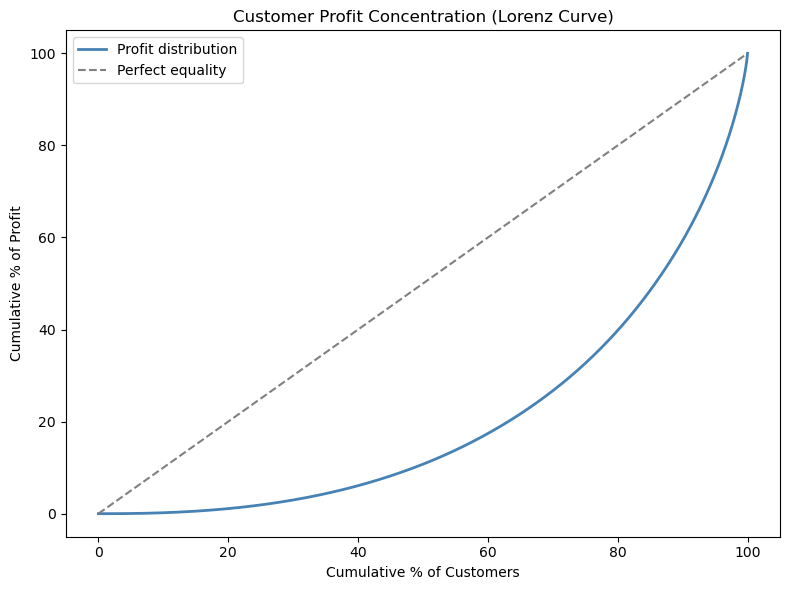


**Findings:**

* Top 20% of customers generate approximately 60% of total lifetime profit.
* Bottom 50% of customers generate only 10–15% of total profit, representing a long tail of low economic impact.
* Lorenz curve shows strong deviation from the equality line, confirming highly concentrated profit distribution.
* Business is highly dependent on a relatively small group of high-value customers and profit concentration is sufficiently high that relatively small changes in high-value customer behavior would materially impact overall profitability.


**Recommended actions:**

* Protect high-value customers through retention initiatives.
* Retention investment should be proportional to customer lifetime profit, considering that the top 20% generate significantly more revenue than the bottom 50%.
* Avoid treating all churned customers equally because a churned Top 1% customer represents more recoverable value than many of the bottom tier customers combined.
* Monitor profit concentration risk.


[SQL customer value concentration code](09_customer_value_concentration.sql)  
[Python customer value concentration code](09_customer_value_concentration.ipynb)


#### 9.7 - Delivery Performance

Delivery performance was analyzed to evaluate operational efficiency and determine whether meaningful differences 
exist across markets.

**What was done:**

Delivery time was calculated as the difference in days between order date and delivery date. Metrics analyzed:

* average delivery time.
* median delivery time.
* 90th percentile delivery time (P90).

**WHy this approach:**

Evaluating both average and P90 delivery time provides a more complete picture than the mean alone. The P90 gives the delivery  time that 90% of orders do not exceed, which is a more operationally meaningful indicator than the average that can be distorted by a small number of delayed orders.

**Visualizations:**

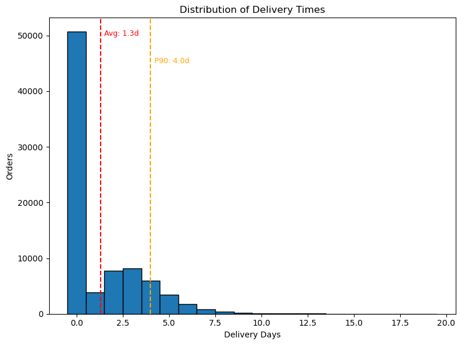  

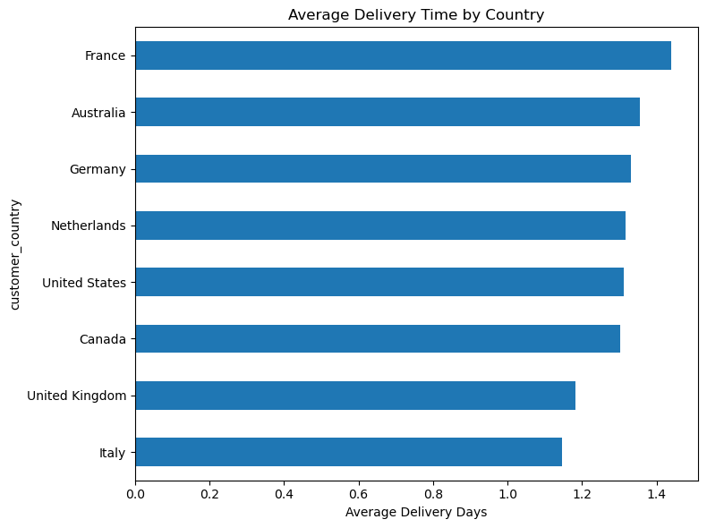


**Findings:**

* Average delivery time is 1.3 days.
* Median delivery time is 0 days (frequent same day deliveries).
* 90% of orders arrive within 4 days (10% of orders take longer than 4 days).
* Delivery performance is consistent across countries (averages range only from 1.15 to 1.44 days). 
* Long delays are rare (only 21 orders took longer than 15 days).

**Recommended actions:**

* Maintain current logistics performance.
* Monitor orders exceeding the 90th percentile delivery time.


[SQL Delivery performance code](10_delivery_performance.sql)  
[Python Delivery performance code](10_delivery_performance.ipynb)  

#### 9.8 - Seasonality Analysis

Seasonality analysis was conducted to identify recurring temporal patterns in orders, revenue and profit across months and days of the week. This type of analysis helps organisations anticipate demand fluctuations and align inventory planning and marketing campaigns with periods of naturally higher or lower demand. Analyzing both long-term trends and within-year patterns provides complementary views of purchasing behavior.

**What was done:**

Three temporal dimensions were analyzed:

* Monthly revenue and profit trends across the full dataset period (2015–2024).
* Average monthly performance across years to isolate seasonal patterns independent of overall growth trends.
* Order volume by day of week.

**Why this approach:**

Seasonality was evaluated using average monthly revenue across years, with profit and order volume used as supporting metrics. The averages were used rather than totals to avoid overstating months with more years of data coverage in the dataset (reminder: the last year of the dataset only has data up to April). Revenue was chosen as the primary visualization because it provides the clearest and cleanest proxy for demand, since it's not distorted by cost fluctuations, margin difference and directly reflects sales volume x price, whereas profit is for sensitive to supplier cost changes, discounting and product mixing strategies. 

**Visualizations:**

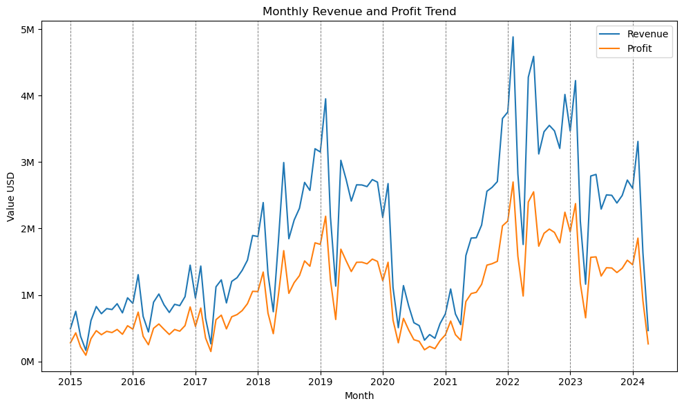  

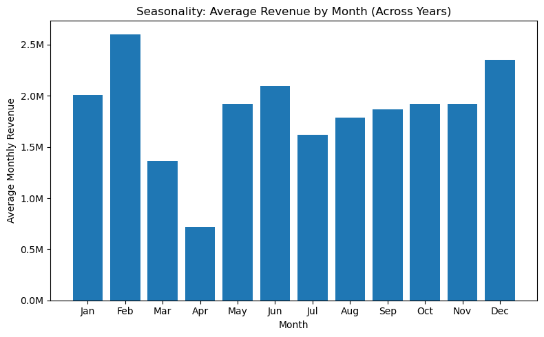  

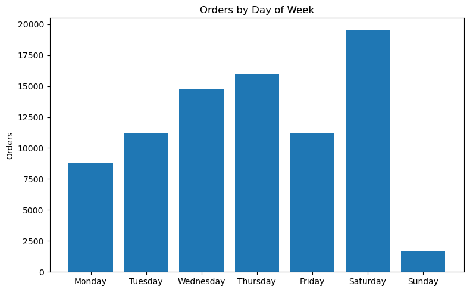 

**Findings:**

* February and December generate the highest average monthly revenue (seasonal demand pattern, possibly Xmas and Valentine's day).
* April is consistently the weakest month across years.
* Overall revenue and order volume grew steadily from 2015 through 2022, followed by a plateau in 2023.
* Order activity varies meaningfully across the week with Saturday recording the highest order volume of the week while Sunday is consistently and by far the weakest.
* The decline in 2024 probably reflects partial-year coverage rather than a true contraction.


**Recommended actions:**

* Incorporate seasonal patterns into marketing campaign planning. Depending on strategic objectives, marketing investment could either be concentrated on peak periods (February and December) to capitalise on existing demand or on weaker months (April) to stimulate growth. The data identifies the pattern but the strategic choice depends on margin targets and campaign costs.
* Adjust inventory planning ahead of peak months.

 

[SQL code Seasonality Analysis]()  
[Python code Seasonality Analysis]()  

#### 9.9 - Statistical Validation

In order to validate selected findings from earlier sections (segmentation and delivery performance), statistical tests were conducted. These will help understand if observed differences across groups were statistically significant or just random variation.

**What was done:**

Two one-way ANOVA tests were performed:

* Test 1 — Average Order Value compared across Customer Segments - does this segmentation actually work?

* Test 2 — Delivery Time across Countries - ware these countries differences meaningful or just noise?
  * Note about test 2 - Descriptive analysis already suggested minimal variation across markets. This test was conducted to formally confirm that finding and to illustrate an important statistical principle that large sample sizes can produce statistically significant results even when practical differences are negligible.


**Why this approach:**

The tests were selected based on the type of the outcome variable and the number of groups being compared.

Both tests involve a continuous numeric outcome (order revenue or average order value AOV and delivery days) compared across three or more independent groups (customer segments and countries). This calls for one-way ANOVA, which tests whether group means differ significantly across multiple independent groups while examining the effect of a single categorical grouping variable (one-way).

A t-test was not used because it is limited to two-group comparisons. 
A chi-square test was not appropriate because the outcome variables are continuous, not categorical.

<u>Test 2 note</u>: delivery time is right-skewed (median = 0 days), which would normally violate ANOVA's normality assumption. However, given the large sample size across all country groups (ranging from 2,399 to 43,531 orders), the Central Limit Theorem ensures that the sampling distribution of group means is approximately normal regardless of the underlying distribution, making the use of ANOVA acceptable.

**Findings:**

<u>Important note</u>: with a large sample size, even small differences become statistically significant. Therefore, results should be interpreted alongside 
practical magnitude, not p-value alone because this one only confirms if a difference exists, but says nothing about its size or practical importance.


* Test 1 - Average Order Value across Customer Segments:
  * H0: mean order revenue is equal across all customer segments.
  * H1: at least one segment has a different mean order revenue.
    * F-statistic: 4,197.96
    * p-value: < 0.001 (reject H0 because p-value < 0.05)
  
  Interpretation: H0 is rejected. Average Order Value differs significantly across customer segments (p-value < 0.05). The large F-statistic value confirms that between-segment variation greatly exceeds within-segment variation, validating that the combined RFM and value segmentation captures genuinely distinct purchasing behaviors rather than arbitrary groupings. 


* Test 2 - Delivery Time across Countries
  * H0: mean Delivery Time is equal across all countries.
  * H1: at least one country has a different mean Delivery Time.
    * F-statistic: 9.46
    * p-value: < 0.001 (reject H0 because p-value < 0.05)

  Interpretation: H0 is rejected. Delivery Time differs significantly across countries (p-value < 0.05). Although statistically significant differences exist, the magnitude of the differences is small (country averages range from 1.15 to 1.44 days, a difference of less than 0.3 days) which may not be operationally meaningful. The modest F-statistic reflects that, country-level differences are small relative to the natural variation within each market. Delivery performance is considered operationally consistent across all markets.


**Recommended actions:**

* Segmentation is statistically validated, so marketing and retention strategies can be confidently built around the combined segment classifications.
* Delivery performance differences across countries are not operationally meaningful, so no market-specific intervention seems to be needed based on current data.


[SQL Statistical Validation code]()  
[Python Statistical Validation code]()  


## 10 - Limitations

* Fictitious data;
* Limited demographic fields;
* No marketing data (no ROI);
* No return/refund sales data;
* The final year of the dataset stops in April;
* Statistical significance may be influenced by the large dataset size.


## 11 - Tools Used

* **SQL (PostgreSQL)**
  * views, window functions, CTEs and aggregations.
  * cohort analysis, RFM scoring and segmentation.

* **Python**
  * pandas (data manipulation and validation).
  * matplotlib / seaborn (visualization).
  * scipy - statistical testing (ANOVA).

* Visual Studio Code
  * code execution.

* Git & GitHub
  * push commands for publishing.

## 12 - Future Improvements
This section highlights potential extensions that could deepen the analysis or improve methodological accuracy.

* **Deeper cohort analysis** - Segment by new vs returning customers, product types or acquisition channel.
* **Statistical depth** - Effect size metrics were not included in the statistical validation section. Adding these would allow distinction between statistical and practical significance.
* **Predictive modeling** - A regression model predicting customer lifetime value or churn probability would extend the analysis from descriptive to predictive.
* **RFM frequency limitation** - The frequency dimension of RFM scoring uses manual thresholds due to the highly skewed order count distribution (55% of customers ordered once). A future version could explore alternative scoring approaches or additional behavioral features to better differentiate low-frequency customers.
* **Customer lifetime value forecasting** - The current analysis calculates historical customer value. Future work could estimate expected future lifetime value, enabling more precise targeting of marketing and retention resources.
* **Product-level profitability analysis** - This project focuses primarily on customer-level value. Further analysis could examine product categories or product-level margins to identify items that drive profitability or loss. 
* **Marketing campaign evaluation** - If related data were available, the analysis could evaluate customer acquisition channels and marketing ROI, linking customer cohorts to campaign performance. 


## 13 - Why this project matters
This project demonstrates the ability to:

* transform raw transactional data into analytical datasets
* perform end-to-end customer analytics
* combine SQL data engineering with Python analysis
* translate analytical findings into business insights


